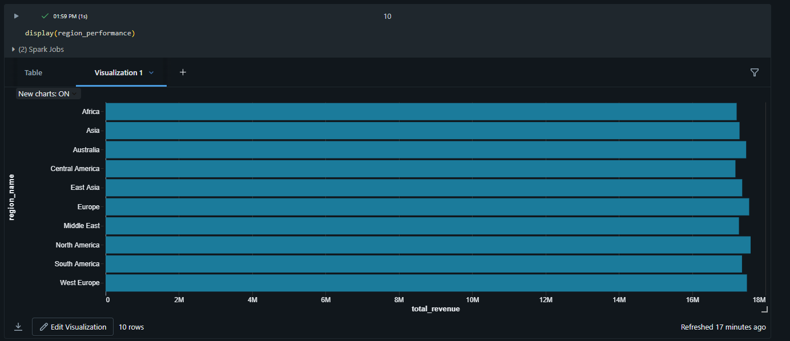
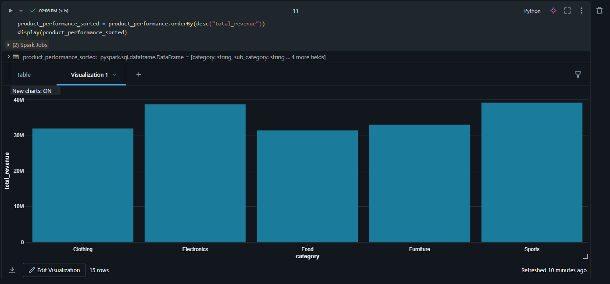
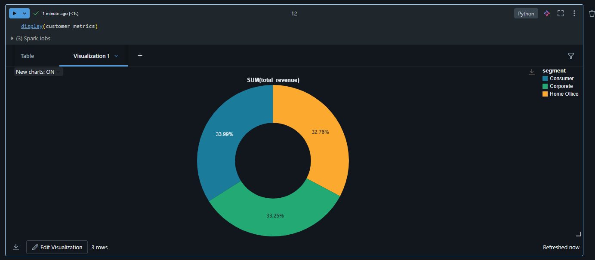

# Global Sales & Retail Performance Analytics System

## 1. Project Overview

This project implements an end-to-end data analytics solution for a global retail organization.  
The objective is to centralize sales data, automate ETL processes, and generate actionable business insights using modern data engineering practices.

The solution is built using Python, Databricks (PySpark), Delta Lake, and Apache Airflow.

---

## 2. Business Problem

The organization faced the following challenges:

- Sales data scattered across multiple CSV files  
- Manual data consolidation leading to delays and inconsistencies  
- No unified regional and product-level performance visibility  
- Limited customer and profitability insights  

This project provides a scalable analytics system to address these issues.

---

## 3. Architecture

The system follows the Medallion Architecture pattern:

Raw CSV Data  
→ Bronze Layer (Raw Delta Tables)  
→ Silver Layer (Cleaned & Enriched Data)  
→ Gold Layer (Business KPI & Aggregated Tables)

### Layers Description

**Bronze Layer**
- Raw ingestion from CSV files
- Stored in Delta format
- Schema enforcement and validation

**Silver Layer**
- Data cleaning and null handling
- Standardized date formats
- Business column derivations
- Enrichment using joins

**Gold Layer**
- KPI aggregations
- Regional performance analysis
- Product category analysis
- Customer segment metrics
- Optimized Delta tables

---

## 4. Data Scope

Synthetic dataset generated for demonstration:

- 100,000 order-level transactions  
- 500 products  
- 5,000 customers  
- 10 regions  

Data includes:

- Order details  
- Revenue and profit metrics  
- Product categories  
- Customer segments  
- Regional markets  

---

## 5. Technology Stack

### Data Processing
- Python
- Pandas
- PySpark

### Big Data Platform
- Databricks
- Delta Lake

### Workflow Orchestration
- Apache Airflow

### Storage
- CSV
- Delta Tables

---

## 6. Key Transformations

- Data validation and null filtering
- Multi-table joins (orders, products, customers, regions)
- Derived columns:
  - Year
  - Month
  - Profit Margin %
  - Revenue Buckets
- Aggregations using groupBy
- Delta optimization (OPTIMIZE, VACUUM)

---

## 7. Business KPIs Generated

### Overall Sales Metrics
- Total Revenue
- Total Profit
- Total Orders
- Average Order Value
- Overall Profit Margin %

### Regional Performance
- Revenue by region
- Profitability by market type
- Order distribution

### Product Analytics
- Revenue by category and sub-category
- Profit margin by product segment
- Quantity sold metrics

### Customer Insights
- Revenue by customer segment
- Profit contribution by segment
- Unique customer count

---

## 8. Workflow Automation

An Apache Airflow DAG is included to demonstrate ETL orchestration:

- Bronze layer execution
- Silver transformation
- Gold aggregation
- Task dependency management
- Retry configuration
- Scheduled execution

---

## 9. Delta Lake Optimization

The project demonstrates production-grade optimizations:

- Delta table storage
- OPTIMIZE command for compaction
- VACUUM for storage cleanup
- Managed table registration

---

## 10. Project Structure
global-sales-analytics/
│
├── notebooks/
│ ├── 00_generate_synthetic_data.py
│ ├── 01_bronze_layer.py
│ ├── 02_silver_layer.py
│ ├── 03_gold_layer.py
│
├── airflow/
│ └── sales_etl_dag.py
│
└── README.md

---

## 11. Dashboard Visualizations

### Regional Performance

### Product Category Performance

### Customer Segment Distribution

